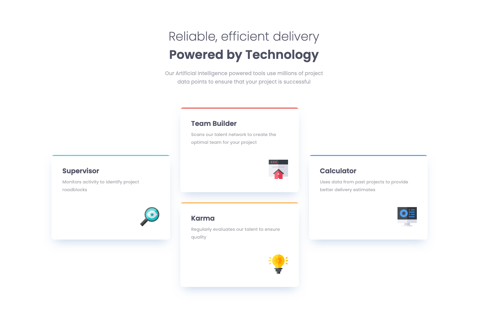

# Four Card Feature Section Solution

This is a solution to the [Four card feature section challenge on Frontend Mentor](https://www.frontendmentor.io/challenges/four-card-feature-section-weK1eFYK). The challenge focuses on building a visually engaging and responsive feature section, showcasing various features with a clean, modern layout.

## Technologies Used

- **HTML**: Structure of the webpage.
- **SCSS (Sass)**: Used for styling.

## Screenshot and Links

| [Frontend Mentor](https://www.frontendmentor.io/solutions/four-card-feature-section-WPOry6X9g_) | [Live Demo URL](https://ionstici.github.io/four-card-feature-section) |
| ----------------------------------------------------------------------------------------------- | --------------------------------------------------------------------- |

